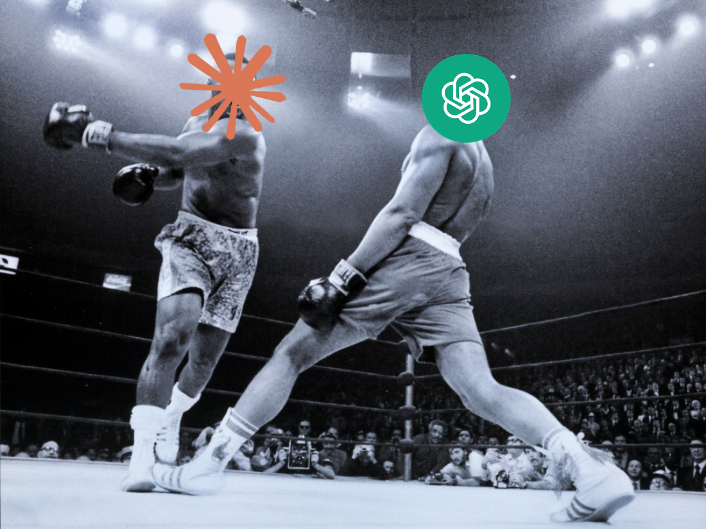

# Sparring Skill



[](https://github.com/nyxandro/sparring-skill/raw/main/dist/sparring.skill)

Sparring Skill is for the moments when one model's answer is not enough.

Ask your main agent to “do sparring with Claude” or “do sparring with Codex”, and it will ask the
other CLI agent for an independent opinion, read the answer, and fold that second point of view
back into the final response.

Use it for:

- brainstorming an idea before implementing it;
- getting a second opinion on architecture or a plan;
- reviewing code or a risky change;
- comparing alternatives;
- stress-testing your own conclusion.

The normal workflow is intentionally simple:

```text
Do sparring with Claude on this plan.
Run a sparring review with Codex.
Get a second opinion through sparring.
Discuss this architecture with Claude.
```

The skill handles the mechanics: chooses the right CLI command, writes temporary answer files,
reads them back, cleans them up, and summarizes what changed after the sparring.

## How It Works

The production path is print-first:

- Claude is called through `claude -p`.
- Codex is called through `codex exec`.
- Multi-turn sparring keeps a small local session history and sends it as context on the next turn.
- Temporary output files are deleted after they are read unless you explicitly ask to keep them.

There is also a tmux fallback for live interactive agents. Use it only when print mode is not
available or when you specifically want to watch the other agent in a terminal session.

## Install

The skill expects this repository to be available locally and `bin/sparctl` to be executable.

Install the current skill file into OpenCode:

```bash
mkdir -p ~/.config/opencode/skills/sparring
unzip -p dist/sparring.skill sparring/SKILL.md > ~/.config/opencode/skills/sparring/SKILL.md
```

Install it into Claude Code:

```bash
mkdir -p ~/.claude/skills/sparring
unzip -p dist/sparring.skill sparring/SKILL.md > ~/.claude/skills/sparring/SKILL.md
```

Restart OpenCode or Claude Code after updating the skill.

## Requirements

- Bash 4+.
- GNU `timeout` for print mode.
- `claude` and/or `codex` installed and authenticated.
- `tmux` only for fallback/live mode.

## Developer Commands

Most users do not need these directly; the skill calls them for you.

```bash
# One-off second opinion.
bin/sparctl ask-print claude "Review this plan" /tmp/claude.txt

# Multi-turn sparring with local history.
bin/sparctl ask-session claude /tmp/sparring.log "First question" /tmp/turn-1.txt
bin/sparctl ask-session claude /tmp/sparring.log "Follow-up" /tmp/turn-2.txt

# Prefer print mode, fall back to tmux if needed.
bin/sparctl ask-auto claude "Review this implementation" /tmp/claude-auto.txt

# Live tmux session, only when you want to watch or when print mode is unavailable.
bin/sparctl start claude
tmux attach -t spar-claude
bin/sparctl stop claude
```

Run the full regression suite:

```bash
bash test/run-all.sh
```

## Project Layout

```text
bin/sparctl        print-first CLI plus tmux fallback controls
lib/print-agent.sh claude -p / codex exec providers and session history
lib/tmux-agent.sh  live tmux fallback primitives
test/              smoke and regression tests
dist/sparring.skill packaged skill
```

## Notes

Print mode is preferred because it captures clean stdout and avoids terminal scraping. tmux mode is
kept for agents that only expose an interactive TUI, but it is inherently more heuristic.

## License

MIT
